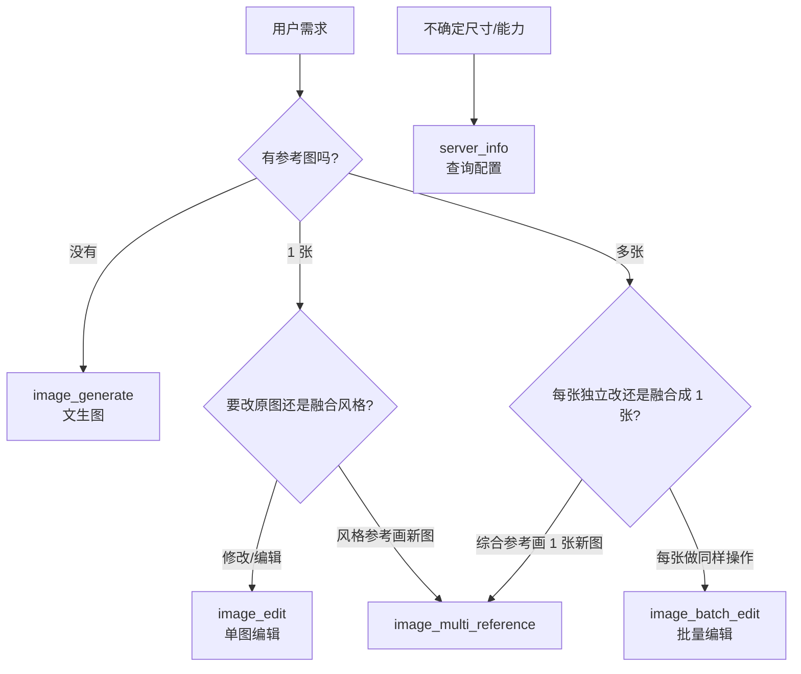

# micu-image-mcp 使用教程

面向 Cursor / Claude Code / Codex 等 MCP 客户端用户，帮助你快速理解并正确使用「米醋画图 MCP」的全部能力。

---

## 一、这是什么？

**micu-image-mcp** 是一个 MCP（Model Context Protocol）服务器，把 [米醋 API](https://www.micuapi.ai) 的图像生成能力封装成 5 个工具，让 AI 助手可以直接：

- 根据文字描述生成图片
- 编辑已有图片（换背景、改局部、加细节等）
- 批量处理多张图片
- 融合多张参考图生成新图
- 查询当前配置与能力边界

生成的图片会**自动保存到本地磁盘**，返回结果中包含文件的绝对路径，方便你在 IDE 或文件管理器中打开。

默认主通道模型为 `gpt-image-2` / `gpt-image-2-pro`。可选配置 Grok 图像通道（`grok-imagine-image-*` 系列）。

---

## 二、安装与配置（Cursor）

### 2.1 一键安装（推荐）

```bash
git clone https://github.com/Subaru486desuwa/micu-image-mcp.git
cd micu-image-mcp
python install.py
```

安装脚本会检查 Python ≥ 3.10、安装依赖、配置 API Key、写入 Claude/Codex 配置，并做一次 MCP 握手验证。

非交互安装：

```bash
MICU_API_KEY=sk-你的密钥 \
MICU_SAVE_DIR=~/Pictures/micu-out \
python install.py --yes
```

### 2.2 手动配置 Cursor

在 `~/.cursor/mcp.json` 中添加：

```json
{
  "mcpServers": {
    "micu-image-mcp": {
      "command": "/path/to/micu-image-mcp/.venv/bin/python",
      "args": ["/path/to/micu-image-mcp/server.py"],
      "env": {
        "MICU_API_KEY": "sk-你的Image2分组密钥",
        "MICU_SAVE_DIR": "/home/你的用户名/Pictures/micu-out",
        "MICU_SAVE_DIR_ROOT": "/home/你的用户名/Pictures/micu-out"
      }
    }
  }
}
```

配置完成后**重启 Cursor**，在 MCP 面板中确认 `micu-image-mcp` 显示为已连接。

### 2.3 环境变量说明

| 变量 | 默认值 | 说明 |
|------|--------|------|
| `MICU_API_KEY` | 空 | 米醋 **Image2 分组** token，必须能访问 `gpt-image-2` / `gpt-image-2-pro` |
| `MICU_BASEURL` | `https://www.micuapi.ai` | 米醋 API 地址 |
| `MICU_MODEL` | `gpt-image-2` | 默认模型 |
| `MICU_GROK_API_KEY` | 空 | 可选，米醋 **Grok 图像分组** token |
| `XAI_MODEL` | `grok-imagine-image-lite` | Grok 默认模型 |
| `MICU_GROK_SIZE_MODE` | `contain` | Grok 输出尺寸归一化策略：`contain` / `cover` / `stretch` / `backend` |
| `MICU_SAVE_DIR` | `~/Pictures/micu-out` | 默认输出目录 |
| `MICU_SAVE_DIR_ROOT` | 同 `MICU_SAVE_DIR` | 安全根目录，所有输出必须在其下 |
| `MICU_USE_SHELL_PROXY` | `0` | 设为 `1` 才读取系统 shell 代理 |

> **重要**：Image2 分组和 Grok 分组通常是两把不同的 Key。把 Grok Key 填进 `MICU_API_KEY` 会出现「分组 grok 下模型 gpt-image-2 无可用渠道」错误。

---

## 三、连通性验证

### 3.1 本次实测结果

| 检查项 | 状态 | 说明 |
|--------|------|------|
| Cursor MCP 配置 | ✅ 正常 | `micu-image-mcp` 已写入 `~/.cursor/mcp.json` |
| `server_info` 调用 | ✅ 正常 | API Key 已配置，输出目录为 `/home/wcx/Pictures/micu-out` |
| `image_generate` 调用 | ⚠️ 部分成功 | API 请求可达，但图片落盘在当前环境受阻（见下方） |

### 3.2 如何自行验证

在 Cursor 对话中让 AI 执行：

```
请调用 micu-image-mcp 的 server_info，告诉我当前配置和能力矩阵。
```

预期返回 `api_key_configured: true` 及完整的 `capability_matrix`。

再测试生图：

```
请用 image_generate 生成一张 1024x1024 的红苹果简笔画，basename 设为 test_apple。
```

成功时返回示例：

```json
{
  "ok": true,
  "model": "gpt-image-2",
  "size": "1024x1024",
  "saved": [
    {
      "path": "/home/wcx/Pictures/micu-out/test_apple.png",
      "size_bytes": 123456,
      "actual_size": "1254x1254",
      "actual_megapixels": 1.57
    }
  ],
  "errors": [],
  "notes": []
}
```

### 3.3 当前环境已知问题与解决

本次测试遇到两类错误：

**① HTTP 524 超时**

```
HTTP 524: A timeout occurred
```

原因：米醋上游在高负载时响应超过 Cloudflare 120 秒限制。  
处理：MCP 已内置自动重试；仍失败时改小尺寸（如 `1024x1024`）或稍后重试。

**② SSRF 防护拦截图片下载（旧版本 / 已关闭 fake-ip 放行时）**

```
保存失败: 下载 URL host 'oss.filenest.top' 指向受限地址 198.18.1.23（私网/环回/链路本地/保留），已拒绝（SSRF 防护）
```

原因：chat stream fallback 等路径仍返回 CDN URL，需二次下载。若系统 DNS 将 `oss.filenest.top` 解析到 `198.18.1.x`（Clash / Surge **fake-ip**），且 `MICU_ALLOW_FAKE_IP_DOWNLOAD=0` 时会被拒绝。

**当前版本默认已双层修复，通常无需改代理：**

1. **主路径** `MICU_RESPONSE_FORMAT=auto`（默认）：先请求 `url` 并下载落盘，失败再重试 `b64_json`
2. **URL 路径** `MICU_ALLOW_FAKE_IP_DOWNLOAD=1`（默认）：可信 CDN（`oss.filenest.top`）解析到 fake-ip 时仍允许下载，**不影响 VPN 正常功能**

若仍失败，可检查 `server_info` 中 `response_format` / `allow_fake_ip_download` 是否为预期值；或临时在代理中将 `oss.filenest.top` 加入 fake-ip 排除列表。

---

## 四、五个工具详解

### 工具选择速查



---

### 4.1 `server_info` — 配置与能力查询

**用途**：在调用任何生图工具之前，先了解当前运行时配置、尺寸规则、各工具能力边界。

**参数**：无

**返回要点**：

- `api_key_configured` / `grok_api_key_configured`：密钥是否配置
- `recommended_sizes`：各档位推荐尺寸
- `capability_matrix`：各工具 × 各尺寸档的可用性
- `retry_policy`：重试与并发策略
- `safety_constraints`：安全限制（输出目录、输入大小等）

**使用场景**：

- 首次使用前确认配置是否正确
- 不确定该用哪个尺寸时查阅 `recommended_sizes`
- 排查「为什么 4K 编辑被拒绝」等问题

**示例对话**：

> 请先调用 server_info，告诉我 2K 文生图是否可用，以及推荐尺寸。

---

### 4.2 `image_generate` — 文生图

**用途**：根据文字描述从零生成 1～10 张图片。

**何时使用**：

- 用户说「画一张…」「生成一张…」「创建 logo/海报/壁纸」
- **没有**提供任何参考图

**参数**：

| 参数 | 类型 | 必填 | 说明 |
|------|------|------|------|
| `prompt` | string | ✅ | 图像描述，1–2000 字符 |
| `size` | string \| null | | `"WxH"` 格式，如 `"1024x1024"`；留空则从 prompt 关键字自动推断 |
| `n` | int | | 生成张数 1–10；1K 可多张并发，≥2K 强制 n=1 |
| `model` | string \| null | | `gpt-image-2` 或 `gpt-image-2-pro`；留空按尺寸自动选择 |
| `save_dir` | string \| null | | 输出目录，必须在 `MICU_SAVE_DIR_ROOT` 下 |
| `basename` | string \| null | | 文件名前缀，仅允许 `[A-Za-z0-9_\-.]` |
| `api_key` | string \| null | | 临时覆盖环境变量中的 Key |

**尺寸速查**：

| 档位 | 推荐尺寸 | 实际输出 | 速度 |
|------|----------|----------|------|
| 1K | `1024x1024`, `1536x1024`, `1024x1536` | ~1.57MP（福利档） | 快，~30s |
| 2K | `2048x2048`, `2048x1152`, `1152x2048` | 真 2K | ~80s，自动 pro |
| 4K | `3840x2160`, `2160x3840` | 真 4K | ~80s，自动 pro |

> W 和 H 必须是 **8 的倍数**。`1920x1080` 等 ≤2.25MP 的尺寸会被压到 ~1.57MP。

**Prompt 写法建议**：

- 中英文均可；gpt-image-2 文字渲染能力强，可直接在 prompt 中写要显示的文字
- 越具体越好：风格、视角、光线、主体、细节程度
- 例：`"极简风格寿司吉祥物 logo，柔和粉彩配色，白色背景，居中构图"`

**示例对话**：

> 帮我生成一张赛博朋克东京夜景 4K 横屏壁纸。

AI 应调用：

```
image_generate(
  prompt="cyberpunk Tokyo at night, neon lights, rain reflections, cinematic",
  size="3840x2160"
)
```

> 画 4 张可爱猫咪贴纸让我挑选。

```
image_generate(
  prompt="cute cat sticker, kawaii style, transparent-friendly composition",
  size="1024x1024",
  n=4
)
```

---

### 4.3 `image_edit` — 单图编辑

**用途**：接受 1 张本地图片 + 修改指令，输出编辑后的图片。

**何时使用**：

- 用户提供 **1 张图**，要修改、替换、添加或删除某部分
- 对刚生成的图做后续调整

**参数**：

| 参数 | 类型 | 必填 | 说明 |
|------|------|------|------|
| `prompt` | string | ✅ | 修改指令 |
| `image_path` | string | ✅ | 输入图路径（绝对或相对），支持 PNG/JPG/WebP |
| `mask_path` | string \| null | | 可选 alpha mask PNG；透明区域 = 编辑区，不透明 = 保留 |
| `size` | string | | 输出尺寸，默认 `1024x1024` |
| `model` | string \| null | | 模型，≥2K 自动切 pro |
| `save_dir` | string \| null | | 输出目录 |
| `basename` | string \| null | | 文件名前缀 |
| `api_key` | string \| null | | 临时覆盖 Key |

**Mask 工作原理**：

- `mask_path` 指向与输入图同尺寸的 PNG
- **alpha=0（透明）** 的像素 → 要修改的区域
- **alpha=255（不透明）** 的像素 → 保持原样
- 不传 mask → 模型自由决定修改范围

**尺寸限制**：

| 档位 | 可用性 | 说明 |
|------|--------|------|
| 1K | ✅ 稳定 | ~1.57MP，~10s |
| 2K | ⚠️ best-effort | 约 2/3 成功真 2K；失败时 fallback ~1.57MP，2–4 分钟 |
| 4K | ❌ 已禁用 | 入口直接拒绝；请用两步法（见下文） |

**示例对话**：

> 把 `/home/wcx/Pictures/portrait.jpg` 的背景换成日落海滩，人物保持不变。

```
image_edit(
  prompt="replace background with a sunset beach, keep the subject pixel-identical",
  image_path="/home/wcx/Pictures/portrait.jpg"
)
```

> 只把头发改成银色（我有 mask 文件）。

```
image_edit(
  prompt="change hair color to silver",
  image_path="/home/wcx/Pictures/x.png",
  mask_path="/home/wcx/Pictures/x_mask.png"
)
```

---

### 4.4 `image_batch_edit` — 批量编辑

**用途**：对多张输入图分别应用**同一条**修改指令，N 张进 → N 张出。

**何时使用**：

- 多张图要做相同操作：批量换底、统一调色、加水印、转素描风格等

**何时不用**：

- 只有 1 张图 → 用 `image_edit`
- 多张图作风格参考画 1 张新图 → 用 `image_multi_reference`

**参数**：

| 参数 | 类型 | 必填 | 说明 |
|------|------|------|------|
| `prompt` | string | ✅ | 应用到每张图的指令 |
| `image_paths` | string[] | ✅ | 输入图路径列表，建议 2–20 张 |
| `size` | string | | 仅支持 1K 档，默认 `1024x1024` |
| `model` | string \| null | | 模型 |
| `save_dir` | string \| null | | 输出目录；文件名为 `batch_<时间戳>_<序号>.png` |
| `api_key` | string \| null | | 临时覆盖 Key |

**并发策略**：

- non-pro 模型：5 并发
- pro 模型：串行 + 1.5s 间隔
- 单张失败不影响其他张

**示例对话**：

> 把这 3 张产品图都转成铅笔素描风格。

```
image_batch_edit(
  prompt="convert to pencil sketch style",
  image_paths=[
    "/home/wcx/Pictures/product_a.jpg",
    "/home/wcx/Pictures/product_b.jpg",
    "/home/wcx/Pictures/product_c.jpg"
  ],
  size="1024x1024"
)
```

---

### 4.5 `image_multi_reference` — 多图融合参考

**用途**：输入 2–10 张参考图 + prompt，综合所有图的视觉信息，输出 **1 张全新**的图片。

**何时使用**：

- 「这几张是同一产品不同角度，画一个新角度」
- 「按这些图的风格画一张 X」
- 「这是 logo 主图和辅助图，做成海报」

**与 `image_batch_edit` 的区别**：

| | `image_batch_edit` | `image_multi_reference` |
|--|-------------------|------------------------|
| 输入 | N 张图 | 2–10 张图 |
| 输出 | N 张图（每张独立改） | **1 张**新图（融合参考） |
| 场景 | 批量做同样操作 | 综合多张图的风格/元素 |

**参数**：

| 参数 | 类型 | 必填 | 说明 |
|------|------|------|------|
| `prompt` | string | ✅ | 综合指令 |
| `image_paths` | string[] | ✅ | 2–10 张参考图路径 |
| `size` | string | | 输出尺寸，默认 `1024x1024` |
| `model` | string \| null | | 模型 |
| `save_dir` | string \| null | | 输出目录 |
| `basename` | string \| null | | 文件名前缀 |
| `api_key` | string \| null | | 临时覆盖 Key |

**限制**：

- 单张参考图建议 ≤2MB，总输入 ≤8MB
- 1K 稳定 ~1.57MP；2K best-effort；4K 已禁用

**示例对话**：

> 把草图、角色、背景这三张图融合成一张电影海报。

```
image_multi_reference(
  prompt="combine these into a single cinematic poster with dramatic lighting",
  image_paths=[
    "/home/wcx/Pictures/sketch.png",
    "/home/wcx/Pictures/character.png",
    "/home/wcx/Pictures/background.png"
  ]
)
```

---

## 五、尺寸与能力矩阵

### 5.1 核心规则

1. **W/H 必须是 8 的倍数**（image2 路径）
2. **W/H 范围 256–4096**
3. **≤2.25MP**（如 1024²、1920×1080）→ 被代理压到 **~1.57MP** 福利档
4. **≥2K 自动切 `gpt-image-2-pro`**，且 **n 强制为 1**
5. **2K/4K 有跨进程锁**：多窗口同时请求会串行排队

### 5.2 各场景能力

| 场景 | 工具 | 可靠性 | 实际输出 |
|------|------|--------|----------|
| 1K 文生图 | `image_generate` | ✅ 可靠 | ~1.57MP |
| 2K/4K 文生图 | `image_generate` | ✅ 真分辨率 | 2048² / 3840×2160 |
| 1K 单图编辑 | `image_edit` | ✅ 可靠 | ~1.57MP |
| 2K 带参考图编辑 | `image_edit` | ⚠️ best-effort | 约 2/3 真 2K |
| 1K 多图融合 | `image_multi_reference` | ✅ 可靠 | ~1.57MP |
| 2K 多图融合 | `image_multi_reference` | ⚠️ best-effort | 约 2/3 真 2K |
| 4K 带参考图 | `image_edit` / `image_multi_reference` | ❌ 禁用 | 入口拒绝 |
| 批量编辑 ≥2K | `image_batch_edit` | ❌ 禁用 | 仅 1K |

### 5.3 两步法：带参考图想要 4K

由于 4K + 参考图会触发 Cloudflare 524 超时，官方推荐：

1. 先用 `image_edit` 或 `image_multi_reference` 出 1K/2K 综合图
2. 再用 `image_generate` 描述同一场景升分辨率：

```
image_generate(
  prompt="同一场景的高清 4K 版本，保持构图与风格一致：...",
  size="3840x2160"
)
```

---

## 六、Grok 通道（可选）

配置 `MICU_GROK_API_KEY` 后，可在 `model` 参数中指定 Grok 模型：

| 模型 | 用途 |
|------|------|
| `grok-imagine-image-lite` | 快速文生图（默认） |
| `grok-imagine-image` | 标准质量 |
| `grok-imagine-image-pro` | 高质量 |
| `grok-imagine-image-edit` | 单图参考/编辑 |

**与 image2 的主要差异**：

| 能力 | image2 | Grok |
|------|--------|------|
| 文生图 4K | ✅ | ❌（映射到 2K） |
| 局部 mask | ✅ | ❌（忽略） |
| 批量编辑 | ✅ | ❌ |
| 尺寸约束 | 8 倍数、4096 边长 | 仅校验 WxH 格式 |
| 实际输出尺寸 | 2K/4K 文生图可精确 | 不保证等于请求尺寸 |

Grok 尺寸归一化由 `MICU_GROK_SIZE_MODE` 控制：

| 值 | 行为 |
|----|------|
| `contain` | 等比缩放，补边（默认） |
| `cover` | 等比缩放，居中裁切铺满 |
| `stretch` | 拉伸（可能变形） |
| `backend` | 保留后端原始像素 |

---

## 七、返回结果字段说明

所有生图工具返回 JSON 字典，通用字段：

| 字段 | 类型 | 说明 |
|------|------|------|
| `ok` | bool | 是否至少成功 1 张/次 |
| `model` | string | 实际使用的模型 |
| `size` | string | 请求的尺寸 |
| `saved` | list/dict | 成功保存的文件信息 |
| `errors` | list | 失败描述列表 |
| `notes` | list | 路由决策、降级、尺寸偏差等说明 |

`saved` 中每项包含：

| 字段 | 说明 |
|------|------|
| `path` | 文件绝对路径 |
| `size_bytes` | 文件字节数 |
| `actual_size` | 从图片 header 读出的真实像素（如 `"1254x1254"`） |
| `actual_megapixels` | 实际百万像素 |

> **注意**：1K 档请求 `1024x1024` 时，`actual_size` 常为 `1254x1254`（~1.57MP 福利档），属正常现象。

---

## 八、安全机制

MCP 内置多项安全限制：

| 限制 | 说明 |
|------|------|
| 输出目录牢笼 | 所有输出必须在 `MICU_SAVE_DIR_ROOT` 下 |
| basename 校验 | 仅允许 `[A-Za-z0-9_\-.]`，禁止 `/`、`..` |
| 输入图校验 | 按 magic bytes 验证为 PNG/JPEG/WebP/GIF |
| 输入大小 | 单图 ≤4MB；多图参考总和 ≤8MB |
| 响应大小 | 远端响应 ≤25MB |
| SSRF 防护 | 拒绝真内网地址；可信 CDN + fake-ip（198.18.0.0/15）在默认配置下放行 |
| base_url 锁定 | 运行期不可通过 tool 参数修改 API 地址 |

---

## 九、常见错误与排查

| 错误信息 | 原因 | 解决方案 |
|----------|------|----------|
| `未配置 API key` | 环境变量未设置 | 在 mcp.json 的 `env` 中配置 `MICU_API_KEY` |
| `分组 grok 下模型 gpt-image-2 无可用渠道` | Key 分组填错 | Image2 Key 填 `MICU_API_KEY`，Grok Key 填 `MICU_GROK_API_KEY` |
| `size W/H 必须是 8 的倍数` | 尺寸不符合约束 | 改为如 `1024x1024`、`2048x1152` |
| `HTTP 524: timeout` | 上游超时 | 改小尺寸或稍后重试；2K/4K 高负载时偶发 |
| `SSRF 防护` + `198.18.x.x` | 旧版或 `MICU_ALLOW_FAKE_IP_DOWNLOAD=0` | 升级 MCP 或设 `MICU_ALLOW_FAKE_IP_DOWNLOAD=1`；`auto` 模式下 URL 失败会自动重试 `b64_json` |
| `image_path 不存在` | 路径错误 | 使用绝对路径 |
| `size=3840x2160 (4K) 在 image_edit 已禁用` | 4K 编辑不可用 | 改用 2K 或两步法 |
| `basename 含非法字符` | 文件名不规范 | 仅用字母数字下划线连字符 |
| `save_dir 必须在 MICU_SAVE_DIR_ROOT 之下` | 输出目录越界 | 使用配置的默认目录或其子目录 |

---

## 十、实用对话模板

### 文生图

```
请用 micu-image-mcp 生成一张 [描述]，尺寸 [WxH]，保存为 [basename]。
```

### 编辑已有图

```
请编辑图片 [绝对路径]，[修改要求]。
```

### 批量处理

```
请对以下图片批量 [操作]：
- /path/to/a.jpg
- /path/to/b.jpg
- /path/to/c.jpg
```

### 多图融合

```
请参考以下图片的风格/元素，生成一张 [新图描述]：
- /path/to/ref1.png
- /path/to/ref2.png
```

### 查询能力

```
请先调用 server_info，告诉我当前支持哪些尺寸和模型。
```

---

## 十一、输出文件位置

默认保存目录：`~/Pictures/micu-out`（可通过 `MICU_SAVE_DIR` 修改）

文件命名规则：

| 工具 | 默认前缀 |
|------|----------|
| `image_generate` | `gen_<时间戳>` 或 `gen_<时间戳>_<序号>` |
| `image_edit` | `edit_<时间戳>` |
| `image_batch_edit` | `batch_<时间戳>_<序号>` |
| `image_multi_reference` | `multiref_<时间戳>` |

生成成功后，AI 会返回 `saved[].path`，你可以直接在文件管理器或 IDE 中打开。

---

## 十二、卸载

```bash
# 仅移除 MCP 配置（Claude + Codex）
python install.py --reset

# 同时卸载 pip 包
python -m pip uninstall -y micu-image-mcp
```

Cursor 需手动从 `~/.cursor/mcp.json` 删除 `micu-image-mcp` 节。

---

## 附录：工具 API 速查表

| 工具 | 必填参数 | 主要用途 |
|------|----------|----------|
| `server_info` | 无 | 查询配置与能力 |
| `image_generate` | `prompt` | 文生图 |
| `image_edit` | `prompt`, `image_path` | 单图编辑 |
| `image_batch_edit` | `prompt`, `image_paths` | 批量同指令编辑 |
| `image_multi_reference` | `prompt`, `image_paths`（2–10 张） | 多图融合成 1 张 |

---

*文档版本：基于 micu-image-mcp 当前代码库生成，实测环境为 Cursor + WSL2 + Linux。*
